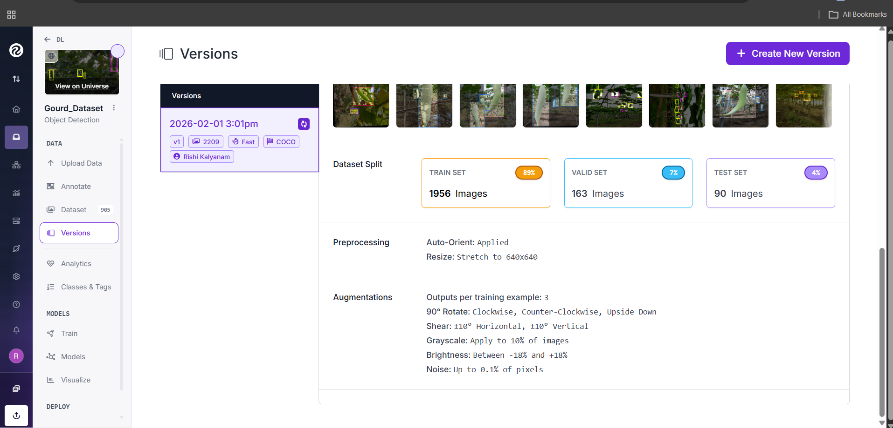
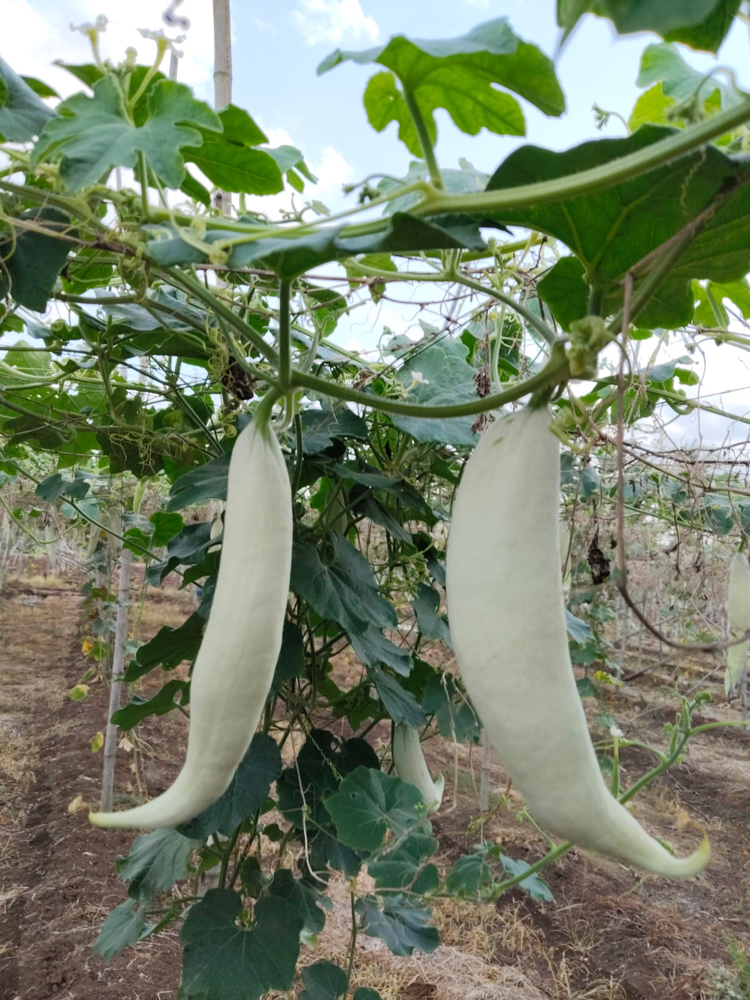
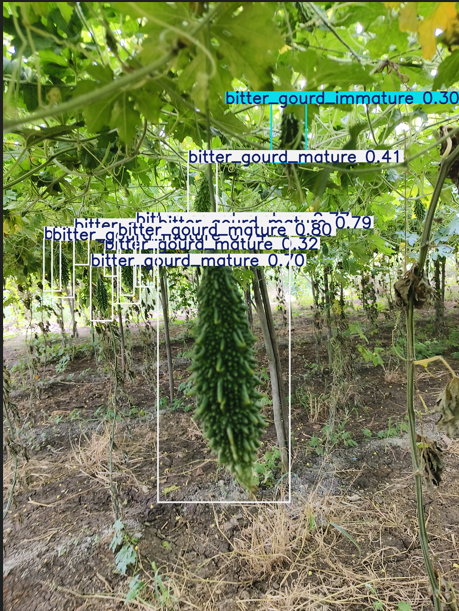
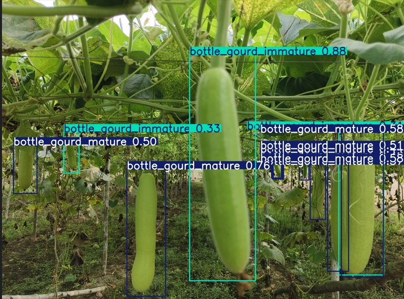
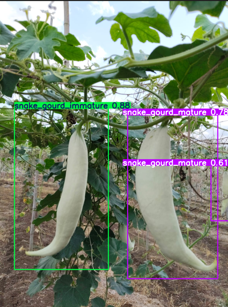
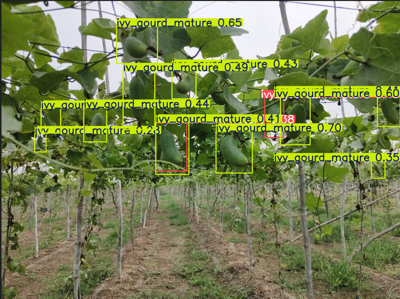
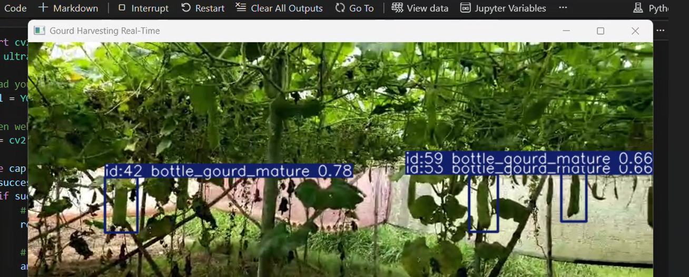

# 🥒 Gourd Maturity Detection using Computer Vision 🫛

<div align="center">


**A computer vision project to detect and classify gourds as mature or immature — built end-to-end from field photography to real-time video detection.**

*Images collected personally from real fields · Labelled by hand · Trained from scratch . *

</div>

---

## 👋 About This Project

This is a **personal project I built completely on my own** as a student. Everything — going to the field and shooting photos with my mobile phone, uploading and labelling each image on Roboflow, configuring augmentations, training the YOLOv8 model, and testing it on live video — was done by me from start to finish.

I wanted to tackle a real problem non-farmers / beginner farmers face: **is this gourd ready to harvest?** It sounds simple, but at scale it's slow, labour-intensive, and hard to automate. I wanted to see if a computer vision model trained on my own data could answer that question just from a camera feed.

---

## ❓ Problem Statement

In agriculture, **timing the harvest correctly** is everything. Pick too early and the produce is low quality; leave it too long and the crop goes to waste. For gourds — bitter gourd, bottle gourd, ivy gourd, snake gourd — the difference between a mature and immature fruit is subtle and varies by variety.

This decision is currently made entirely by **human visual inspection**, which:

- Is **slow and exhausting** at scale across large farms
- Requires **experienced workers** who aren't always available
- **Cannot be integrated** into automated harvesting systems without a machine-readable signal

**Goal:** Train a real-time object detection model that takes a farm image or video frame, draws bounding boxes around each gourd, and classifies it as **mature** (ready to harvest) or **immature** — variety by variety.

---

## 🏗️ System Architecture

> The full pipeline I designed and implemented — from raw field photos to live detection output.


The pipeline has 6 stages:

| Stage | What happens |
|-------|-------------|
| **Dataset Collection** | Photographed gourds in real fields using mobile phone |
| **Dataset Annotation** | Manually labelled every image on Roboflow with bounding boxes |
| **Image Preprocessing** | Resize to 640×640, auto-orient, apply augmentations |
| **Model Training** | Fine-tune YOLOv8n on custom dataset (Train/Val/Test split) |
| **Detection** | Model predicts gourd type + maturity level per bounding box |
| **Output Visualization** | Bounding boxes with class label and Mature/Immature result |

### YOLOv8 Model Architecture

```
Input Image (640×640)
        │
        ▼
┌─────────────────────┐
│      Backbone       │  Conv layers + C2f blocks
│    (CSPDarknet)     │  → Extracts visual features at multiple scales
└──────────┬──────────┘
           │
           ▼
┌─────────────────────┐
│        Neck         │  SPPF + Feature Pyramid Network (FPN)
│   (SPPF + PAN)      │  → Fuses features from different depths
└──────────┬──────────┘
           │
           ▼
┌─────────────────────┐
│   Detection Head    │  3 output scales (small / medium / large objects)
│  (Detect layer ×3)  │  → Predicts box coords + class + confidence
└──────────┬──────────┘
           │
           ▼
   [Bounding Box]  [Class Label]  [Confidence Score]
   bitter_gourd_mature — 0.71
```

**Model stats:** 3,012,798 parameters · 8.2 GFLOPs · 72 layers (fused)

I chose **YOLOv8 Nano** — it's the lightest variant and the only one that was feasible to train on CPU/GPU in a reasonable time.

---

## 📦 Dataset

> I built this dataset entirely from scratch. No pre-existing datasets were used.

### 📸 How I Collected the Images

I went to **real gourd farms** and photographed the crops using my **mobile phone**. I captured images from different angles, distances, and lighting conditions — sunny, overcast, partial shade, close-up, wide — to make the model generalise well to real farm conditions.

### 🏷️ Labelling on Roboflow

After uploading all images to Roboflow, I manually drew bounding boxes around every single gourd and assigned it the correct class. This was the most time-consuming part — annotating hundreds of overlapping, half-hidden gourds in dense canopy photos, one by one.



### 📊 Dataset Statistics

| Split | Images | Proportion |
|-------|--------|------------|
| Train | 1,956 | 89% |
| Validation | 163 | 7% |
| Test | 90 | 4% |
| **Total** | **2,209** | — |

### ⚙️ Preprocessing & Augmentations

| Step | Setting |
|------|---------|
| Auto-Orient | Applied (fixes phone EXIF rotation) |
| Resize | Stretch to **640×640** |
| Outputs per image | **3** augmented versions |
| 90° Rotation | Clockwise, Counter-Clockwise, Upside Down |
| Shear | ±10° Horizontal · ±10° Vertical |
| Grayscale | 10% of images |
| Brightness | −18% to +18% |
| Noise | Up to 0.1% of pixels |

### 🏷️ Detection Classes (10 total)

| ID | Class |
|----|-------|
| 0 | `beans_mature` |
| 1 | `bitter_gourd_immature` |
| 2 | `bitter_gourd_mature` |
| 3 | `bottle_gourd_immature` |
| 4 | `bottle_gourd_mature` |
| 5 | `gourds` |
| 6 | `ivy_gourd_immature` |
| 7 | `ivy_gourd_mature` |
| 8 | `snake_gourd_immature` |
| 9 | `snake_gourd_mature` |

---

## 🌾 Dataset Samples

> These are actual photos I took in the field with my phone — the raw images that became the training data.

<table>
  <tr>
    <td align="center"><br/><b>Beans</b><br/><sub>Dense canopy, multiple pods<br/>hard to separate individually</sub></td>
    <td align="center"><br/><b>Bitter Gourd</b><br/><sub>Hanging from trellis,<br/>textured dark green surface</sub></td>
    <td align="center"><br/><b>Bottle Gourd</b><br/><sub>Large pale green fruits,<br/>clearly visible against foliage</sub></td>
  </tr>
  <tr>
    <td align="center"><br/><b>Ivy Gourd</b><br/><sub>Small oval fruits on trellis,<br/>blend easily with leaves</sub></td>
    <td align="center"><br/><b>Snake Gourd</b><br/><sub>Long white-cream fruits,<br/>very distinctive appearance</sub></td>
    <td align="center"><br/><b>Labelled in Roboflow</b><br/><sub>Bounding boxes drawn manually<br/>on all 2,209 images</sub></td>
  </tr>
</table>

---

## 🔧 Training

```python
from ultralytics import YOLO

model = YOLO("yolov8n.pt")   # COCO pretrained weights as starting point

model.train(
    data="Gourd_Dataset/data.yaml",
    epochs=50,
    imgsz=640,
    batch=8,
    name="gourd-harvest-detector"
)
```

| Parameter | Value |
|-----------|-------|
| Base model | YOLOv8n (pretrained on COCO) |
| Epochs | 50 |
| Image size | 640 × 640 |
| Batch size | 8 |
| Optimizer | AdamW (auto) · lr = 0.000714 |
| Hardware | CPU — Intel Core i7-12650H |
| Training time | ~**6.7 hours** |

---

## 📊 Results

### Overall Performance (Best Checkpoint)

| Metric | Score |
|--------|-------|
| Precision | **0.587** |
| Recall | **0.539** |
| mAP@50 | **0.552** |
| mAP@50-95 | **0.274** |
| Inference speed | ~63ms / image on CPU |

The model improved consistently from mAP@50 = **0.186** at epoch 1 to **0.553** at epoch 50 — a clear sign of genuine learning across the full training run.

### Per-Class mAP@50

| Class | mAP@50 | |
|-------|--------|-|
| `snake_gourd_mature` | **0.885** | ✅ Excellent |
| `bitter_gourd_mature` | **0.821** | ✅ Excellent |
| `snake_gourd_immature` | **0.795** | ✅ Strong |
| `bottle_gourd_mature` | **0.758** | ✅ Strong |
| `ivy_gourd_mature` | 0.568 | 🟡 Decent |
| `bottle_gourd_immature` | 0.411 | 🟡 Moderate |
| `beans_mature` | 0.289 | 🔶 Needs more data |
| `ivy_gourd_immature` | 0.221 | 🔶 Hard to distinguish |
| `bitter_gourd_immature` | 0.220 | 🔶 Hard to distinguish |

**Why mature > immature?** Mature gourds have stronger visual cues — larger size, distinct colour (white, pale green, yellow) — that are easy to learn. Immature gourds are small and green, blending into the vine canopy.

---

## 🖼️ Output Detection Samples

> Model predictions with bounding boxes and confidence scores on test images.
> *(Replace the placeholders below with your actual output images)*

<table>
  <tr>
    <td align="center">
      <br/>
      <sub><b>Output 1</b> — Bitter Gourd detection</sub>
    </td>
    <td align="center">
      <br/>
      <sub><b>Output 2</b> — Bottle Gourd detection</sub>
    </td>
    <td align="center">
      <br/>
      <sub><b>Output 3</b> — Snake Gourd detection</sub>
    </td>
  </tr>
  <tr>
    <td align="center">
      <br/>
      <sub><b>Output 4</b> — Ivy Gourd detection</sub>
    </td>
    <td align="center">
      <br/>
      <sub><b>Output 5</b> — Multi-class video frame</sub>
    </td>
    <td align="center"></td>
  </tr>
</table>

---

## 😓 Challenges I Faced

### 1. 📷 Field data collection is harder than it looks
Photographing crops in the field means dealing with uneven lighting, dense overlapping canopy, and gourds at all sorts of heights and angles. Getting enough variety while not damaging plants took real effort.

### 2. ✏️ Labelling ~900+ images by hand was exhausting
Drawing bounding boxes one by one on hundreds of images — especially when gourds were overlapping, behind leaves, or only partially visible — was the single most time-consuming part of the whole project. I had to stay focused to keep labels accurate.

### 3. 💻 Training on CPU with no GPU
Each epoch took **7–8 minutes**. 50 epochs = over **6.7 hours** of training, run overnight on my laptop. A GPU would have done this in under 30 minutes.

### 4. 🍃 Immature gourds blend into the leaves
Immature gourds are small, green, and nearly invisible against green foliage. The model struggled here — and honestly, so does the human eye. The lower mAP scores for immature classes reflect this real visual ambiguity.

### 5. ⚖️ Class imbalance
Some classes had very few samples (e.g. only 9 instances of `snake_gourd_immature` in validation). This made those classes harder to train reliably.

### 6. 🔍 Resolution matters more than I expected
Running inference on the original 259×194 phone image found fewer objects than running it on the 640×640 resized version. **Matching inference resolution to training resolution is critical** — I learned this the hard way through testing.

---

## 🚀 How to Run

### Install dependencies

```bash
pip install ultralytics opencv-python
```

### Run on a single image

```python
from ultralytics import YOLO

model = YOLO("runs/detect/gourd-harvest-detector2/weights/best.pt")
results = model("your_image.jpg")

for result in results:
    for box in result.boxes:
        cls_id = int(box.cls[0].item())
        conf  = float(box.conf[0].item())
        label = model.names[cls_id]
        print(f"Detected: {label}  (Confidence: {conf:.2f})")

results[0].show()
```

### Real-time video / webcam

```python
import cv2
from ultralytics import YOLO

model = YOLO("runs/detect/gourd-harvest-detector2/weights/best.pt")
cap = cv2.VideoCapture("your_video.mp4")   # or 0 for webcam

while cap.isOpened():
    success, frame = cap.read()
    if success:
        results = model.track(frame, persist=True, imgsz=640, conf=0.5)
        annotated_frame = results[0].plot()
        cv2.imshow("Gourd Harvesting Detection", annotated_frame)
        if cv2.waitKey(1) & 0xFF == ord("q"):
            break
    else:
        break

cap.release()
cv2.destroyAllWindows()
```

---

## 📁 Project Structure

```
gourd-harvesting-detection/
│
├── Gourd_Dataset/
│   ├── data.yaml
│   ├── train/
│   │   ├── images/          ← 1,956 training images
│   │   └── labels/
│   ├── valid/
│   │   ├── images/          ← 163 validation images
│   │   └── labels/
│   └── test/
│       ├── images/          ← 90 test images
│       └── labels/
│
├── runs/detect/gourd-harvest-detector2/
│   └── weights/
│       ├── best.pt          ← Best checkpoint (use for inference)
│       └── last.pt
│
├── assets/                  ← Output detection images go here
│   ├── output1.jpg
│   ├── output2.jpg
│   └── ...
│
├── gourd_harvesting.ipynb   ← Full training + inference notebook
├── gourd_harvesting_architecture.png
└── README.md
```

---

## 🛠️ Tech Stack

<div align="center">

| | Tool | Purpose |
|--|------|---------|
|  | **Python 3.13** | Core language |
|  | **PyTorch** | Deep learning backend |
|  | **Ultralytics YOLOv8** | Model architecture, training & inference |
|  | **Roboflow** | Image annotation, dataset versioning, augmentation |
|  | **OpenCV** | Image & video processing |
|  | **Jupyter Notebook** | Development environment |

</div>

---

## 🔮 Future Improvements

- 🖥️ **Train on GPU** — would cut training time from 6+ hours to ~20 minutes and allow bigger models
- 📸 **More data for immature classes** — especially ivy gourd and bitter gourd which scored lowest
- 🧪 **Try YOLOv8s / YOLOv8m** — slightly larger models that may improve accuracy significantly
- 📱 **Export to TFLite / ONNX** — for deployment on Raspberry Pi or Android in the field
- 🌾 **Build a farmer-facing app** — point your phone camera, get instant harvest recommendation

---

## 👤 About
Rushindra K
---
